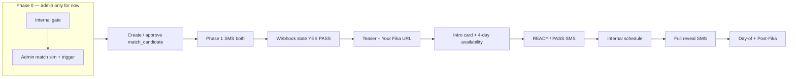

# Fika new protocol — pre-implementation review

> **Purpose:** Single checklist to read **before** coding. Aligns engineering on scope, dependencies, and open decisions. Canonical product specs are linked below — this file **summarizes** and **sequences** work.

> **Status (2026-04):** Legacy **`weekly_match_opt_ins`**, **`weekly_availability`**, and **`weekly_pool`** are **dropped** from the DB (`20260430200000`). Fika socials use **`fika_socials`** / **`fika_social_opt_ins`** (renamed from `weekly_fika_*` in `20260501140000_rename_weekly_fika_to_fika_socials.sql`). `profiles.sms_intro_mode` is **`match_first` only**. Section 3–6 below mix **history** (“today” at time of writing) with **targets** — use schema docs for current tables.

---

## 1. What we’re building (one paragraph)

Replace the **weekly `pg_cron` batch** (opt-in blast → replenish → Tuesday intros) with an **event-driven** flow: **Phase 0** internal gate (today: admin simulation) → **simultaneous** Phase 1 offer to both users → **YES/PASS** → **teaser** (with **Your Fika** link) → **4-day sliding availability** (anchor: `match_candidates.created_at` or equivalent) → **internal scheduling** → **full reveal** → **day-of / post-Fika**. **Retire** weekly pool SMS crons per [`FIKA_CRON_REPLACEMENT.md`](./FIKA_CRON_REPLACEMENT.md).

### Operating mode (current): **admin only**

- **Phase 0 → Phase 1:** All **`match_candidates`** creation and **match-offer SMS** (`sms-match-delivery` with `match_ids`) go through **admin match simulation** + **Trigger SMS** (or equivalent explicit invoke). There is **no** automated “who gets a nudge” list, **no** `replenish-matches` cron, and **no** scheduled bulk intro send.
- **Thresholds / assignment:** **`T_nudge`** (broadcast eligibility) and **“one intro per person per week”** automation are **out of scope until** we add a non-admin pipeline. **`T_final`** and scoring can still matter **later** when pairs are chosen automatically; for now pairing is **human/admin** via simulation.
- **Later (non-admin):** Pre-nudge scoring job, automated assignment, and optional weekend recomputation — **deferred**; revisit when product moves off admin-only.

---

## 2. Canonical documents (read order)

| Order | Doc | What it is |
|-------|-----|------------|
| 1 | [`FIKA_MATCH_PROTOCOL.md`](./FIKA_MATCH_PROTOCOL.md) | Phases 0–7, critical rules, tone |
| 2 | [`FIKA_MATCH_PROTOCOL_MESSAGE_PLAYBOOK.md`](./FIKA_MATCH_PROTOCOL_MESSAGE_PLAYBOOK.md) | Example SMS copy + branching |
| 3 | [`FIKA_YOUR_FIKA_WEB_SMS_FLOW.md`](./FIKA_YOUR_FIKA_WEB_SMS_FLOW.md) | Web + SMS handoff, intro card, availability, `sms:` confirm/PASS |
| 4 | [`FIKA_CRON_REPLACEMENT.md`](./FIKA_CRON_REPLACEMENT.md) | Which `pg_cron` jobs go away vs reminder sweeps |
| 5 | [`FIKA_PRE_IMPLEMENTATION_REVIEW.md`](./FIKA_PRE_IMPLEMENTATION_REVIEW.md) | Build sequence, risks, and open decisions |

Operational docs were updated for the hybrid weekly schema; older paragraphs in this file may still read as “plan” rather than “done” — see the **Status** note above.

---

## 3. Current system (baseline)

| Area | Today (simplified) |
|------|---------------------|
| **Crons** | Six+ jobs hitting Edge Functions: weekly opt-in, follow-up, opt-in expiration, replenish, match delivery, match expiration; plus onboarding, day/3h/post-fika reminders. **Plan:** weekly batch jobs **unscheduled**; reminder jobs **TBD** (see §9.3). |
| **Webhook** | `sendblue-webhook`: concierge routing, **per-match** YES/PASS/scheduling; fika-social lane should write **`fika_social_opt_ins`** (not removed pool tables). |
| **Matching** | Legacy `replenish-matches` + pool tables **removed**. **Admin-only plan:** pairs from **admin simulation** or **`fika_socials` matcher** → `match_candidates` → trigger **`sms-match-delivery`** with explicit `match_ids`. |
| **Modes** | `profiles.sms_intro_mode`: **`match_first` only** in DB; legacy `weekly_pool` label retired. |
| **Phase 0** | Manual via **admin match simulation** (user-confirmed). **This is the only Phase 0 path for now.** |

---

## 4. Target architecture (logical)

- **Single source of truth for SMS decisions:** `sendblue-webhook` (expand state machine).
- **Edge functions:** Batch weekly senders **retired** from cron; **`sms-match-delivery`** remains **on-demand** (admin API → Edge Function with `match_ids`). Phase 5+ sends: **one** pattern (webhook vs Edge helper) still to align.
- **Jobs (admin-only):** **No** automated pre-offer scoring job or **`T_nudge` list** until we exit admin-only. Reminder/day/post-Fika crons remain a **separate** decision (see §9).

---

## 5. State machine (must design explicitly)

Define **per user × match** (and possibly **global** weekly row) states. Minimum concepts:

| State (conceptual) | Notes |
|---------------------|--------|
| `match_offered` / awaiting YES | Phase 1 sent to both |
| `yes_pending_other` | One YES, one pending — **no teaser to either** until both YES (per protocol) |
| `both_yes_pre_teaser` | Unlock teaser + Your Fika |
| `teaser_sent` | |
| `awaiting_availability` | |
| `availability_submitted` / `ready_confirm` | After web save, before READY SMS |
| `scheduling_internal` | Phase 4 |
| `plan_sent` | Phase 5 |
| `confirmed` / `post_fika` | … |

**Must align** with existing `sms_conversation_states` / `SMS_STATES` — either **extend** enums or **new** table for “protocol v2” to avoid breaking in-flight users.

**Open decision:** Migrate old rows vs **feature flag** new path for new matches only.

---

## 6. Data model touchpoints

| Store | Likely changes |
|-------|----------------|
| `match_candidates` | `created_at` as anchor for sliding 4-day window; possibly `offer_phase`, `first_grid_day`, SLA timestamps. |
| `fika_socials` / `fika_social_opt_ins` | **Current** admin session + opt-in model; see `docs/MEETWITHMOAI_SCHEMA.md`. |
| `match_availability` | Per-match availability + READY flow for ad hoc intros (replaces old global weekly availability table). |
| `profiles.sms_intro_mode` | **`match_first` only** (constraint); weekly cohort label removed. |
| `message_ledger` | Already used for outbound; good for audit. |
| New? | Optional `match_offer_events` for Phase 1/5 sends if you need idempotency. |

---

## 7. Surfaces to implement or change

| Surface | Responsibility |
|---------|----------------|
| **Admin match simulation** | Phase 0 already; may need fields for **T_nudge** / **simultaneous send**. |
| **`sendblue-webhook`** | Keywords YES, PASS, READY, HELP; **no** advance one user ahead; 24h/48h nudges (could be cron **or** DB-driven checks on inbound). |
| **`/app/yourfika`** | Intro card visibility rules (both YES?); link from SMS. |
| **`/app/availability`** | Query params or server-computed **four days** from `match_candidates.created_at` + buffer; deadline UI. |
| **Post-availability** | Buttons → `sms:` **READY** / **PASS**; desktop fallback. |
| **Edge functions** | Deprecate batch weekly functions; keep or slim **reminder** functions until queue exists. |
| **Migration** | `cron.unschedule` per [`FIKA_CRON_REPLACEMENT.md`](./FIKA_CRON_REPLACEMENT.md). |

---

## 8. Scoring & thresholds

**Admin-only (current):** Do **not** implement **`T_nudge`**, automated **“one intro per week”** assignment, or a **pre-nudge / replenish-minus-availability** job. Admin selects pairs in simulation; **optional** score display in admin is fine for **human** judgment only.

| Threshold | Use (when not admin-only) |
|-----------|---------------------------|
| **T_nudge** | Who gets a **Phase 1–style** eligibility message from an **automated** list. **Deferred.** |
| **T_final** | Pair still valid for **automated** assignment after both YES + availability. **Deferred.** |

When we add automation, revisit scoring storage, matcher / batch job design (replenish-style logic is gone), and weekly caps.

---

## 9. Open decisions (resolve before or during sprint 1)

**Settled for now:** **Admin-only** pipeline — no automated nudge list, no replenish cron, Phase 0/1 driven by **admin simulation + trigger** (see §1).

1. **Both YES before teaser:** Confirm **Option A** (locked until both YES) vs partial visibility — protocol says **both YES**.  
2. **`sms_intro_mode`:** Migration path and timeline to **drop** `match_first`.  
3. **Reminder crons:** Keep **hourly** sweep for day-of / 3h / post-fika, or invest in **job queue** first.  
4. **Sendblue sends:** All from **webhook** vs **Edge Function** helpers for Phase 1/5 — **one** pattern for idempotency.  
5. **Timezone:** Single PT vs **per-market** for `first_grid_day`.  
6. **Backward compatibility:** New matches only vs migrate in-flight `match_candidates`.  
7. **Exit criteria for admin-only:** What user volume or ops load triggers **T_nudge** + automated assignment (future).

---

## 10. Suggested implementation phases (engineering order)

**Admin-only scope:** Phases **A–D** and **F** are in play; **E** focuses on **internal scheduling + Phase 5** without **automated** pair selection. **Automated** scoring, **`T_nudge`**, and **replenish-style** jobs are **not** in the current plan.

| Phase | Work |
|-------|------|
| **A** | State machine design doc + DB migration sketch (`sms_conversation_states` or new table). |
| **B** | Webhook: Phase 1 YES/PASS/teaser paths **without** breaking existing match_offered flow; feature flag. |
| **C** | Your Fika intro card + availability **sliding 4-day** from `created_at` + buffer. |
| **D** | READY/PASS from web; confirmation SMS. |
| **E** | Internal scheduling + Phase 5 message for **admin-created** matches; **no** `replenish` dependency. |
| **F** | Sunset `pg_cron` weekly jobs + remove dead code paths (weekly opt-in / replenish / scheduled delivery). |
| **G** | Reminder/post-fika alignment + cleanup `sms_intro_mode`. |
| **Future** | Automated **`T_nudge`**, assignment, pre-nudge job — **after** admin-only exit criteria (§9.7). |

---

## 11. Risks

| Risk | Mitigation |
|------|------------|
| **Breaking SMS for live users** | Feature flag per match or `batch_week` cutoff. |
| **State drift** between web and SMS | Single backend transitions; idempotent webhooks. |
| **`sms:` links** flaky on desktop | Copy number + keyword; QA iOS/Android. |
| **Cron removal too early** | Unschedule only after shadow period or dual-run metrics. |

---

## 12. Testing checklist (high level)

- [ ] Phase 1 both YES / one PASS / pending other  
- [ ] Teaser + Your Fika link; card hidden/locked per rule  
- [ ] 4-day grid from Tuesday-created match vs Monday-created  
- [ ] READY → confirmation SMS; PASS → kill  
- [ ] One intro per user per week with overlapping candidates  
- [ ] No weekly cron fires for retired jobs (staging)

---

## Sign-off

| Role | Name | Date | Notes |
|------|------|------|-------|
| Product | | | |
| Eng lead | | | |
| Ops | | | |

---

*Last updated: aligns with docs in `/docs` prefixed `FIKA_*` and `FIKA_CRON_REPLACEMENT.md`.*
